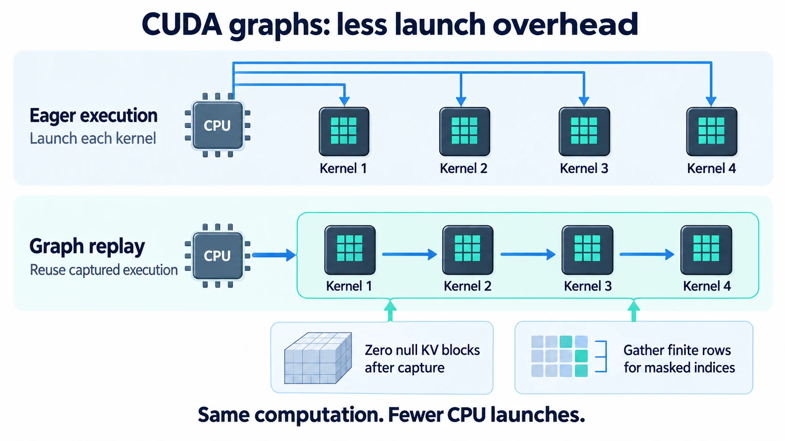
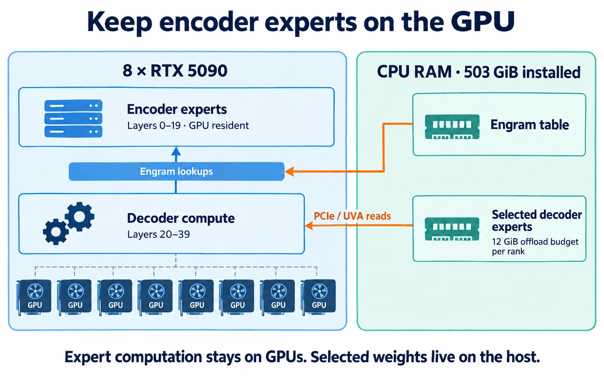

# DeepSeek V4.1 Flash Accel

**Run DeepSeek-V4.1-Flash on eight 32 GB RTX 5090 GPUs.**
Tuned vLLM presets, CPU offload, and the patches needed to serve on consumer
Blackwell over PCIe, with an OpenAI-compatible API. No NVLink required.

| **1.93× single-request generation** | **55% higher batch throughput** | **42% less shared host RAM** |
| :--- | :--- | :--- |
| **33.6 → 65.0 tok/s** | **115.0 → 178.2 tok/s** | **453 → 264 GiB** |
| Synthetic 1K input / 128 output, one active request | Same workload, 32 concurrent requests | Approximately **189 GiB recovered** |
| Latency preset | Throughput preset | Throughput preset |

On the included code and prose prompts, single-request output rises from
**39.8 to 71.4 tok/s (+79.4%)** with the latency preset. The throughput preset
also raises **8K prefill throughput by 23.8%**, from 2,430 to 3,008 total tok/s.

**Results shipped in [`20eeea0`](https://github.com/devin-lai/DeepSeek-V4.1-Flash-Accel/commit/20eeea06b6a23f0703eeb5b9a29855e39a7c8a46).**
Speed figures are three-trial means against this project's previous
`v41-flash` preset, which already includes CUDA graphs and offload patches.
Same host, prompts, seeds, checkpoint, and quantization; **936 timed requests,
zero failures**. Shared RAM is a startup measurement, not total required RAM.
[Full results and trial ranges](benchmarks/results/2026-09-14-v41-optimization.md) ·
[Raw comparison data](benchmarks/results/2026-09-14-v41-optimization/comparison.json).

[Quickstart](#quickstart) · [Benchmarks](#measured-performance) · [How it works](#how-the-optimizations-work) · [Documentation](docs/README.md) · [简体中文](README.zh-CN.md)

## What changed

- **Recover host RAM lost to allocator padding.** Page-rounded pinned weight
  buffers replace power-of-two allocations, recovering about **164 GiB at the
  same expert offload budget**. The final presets keep more experts on GPU,
  bringing shared host RAM to 279 GiB for latency or 264 GiB for throughput.
- **Enable five-token speculative decoding on SM120.** The latency preset
  uses the checkpoint's DSpark drafter with static verification and smaller
  CUDA graph captures. Adaptive verification is unsupported by this backend.
- **Keep more weights on GPU and serve larger batches.** The throughput
  preset lowers expert offload from 12 to 9 GiB/rank and allows 32 active
  sequences, delivering **178.2 output tok/s** on the concurrent workload.

Start with **[`v41-flash-latency`](deploy/presets/v41-flash-latency.env)** for
interactive use. Choose **[`v41-flash-throughput`](deploy/presets/v41-flash-throughput.env)**
for batch work; it improves aggregate throughput while increasing per-request
token latency at 32 concurrent requests. Both build on the repository's
[CUDA graph fixes and decoder-only expert offload](#how-the-optimizations-work).

An independent community project for [DeepSeek-V4.1-Flash](https://huggingface.co/deepseek-ai/DeepSeek-V4.1-Flash),
built on [vLLM](https://github.com/vllm-project/vllm),
[FlashInfer](https://github.com/flashinfer-ai/flashinfer), and
[DeepGEMM](https://github.com/deepseek-ai/DeepGEMM). Experimental; not affiliated
with or endorsed by DeepSeek.

## Supported configuration

| Resource | Reference deployment |
| --- | --- |
| GPU | **8× RTX 5090, 32 GB each**, SM120, PCIe Gen5 ×16, no NVLink |
| Host RAM | **503 GiB installed**; approximately **279 GiB shared** with the latency preset or **264 GiB** with throughput. Latency also tested under a 384 GiB cgroup cap. |
| Checkpoint | Approximately **476 GiB / 510 GB**, plus space for the environment and caches |
| Placement | Engram on CPU; 11 GiB/rank decoder offload for latency, 9 GiB/rank for throughput; TP8 + expert parallelism |
| Context | **32,768 tokens** in the serving presets; the model's advertised 1M context is untested here |
| Text / images | Text benchmarked; simple image probe recorded; broader quality evaluation remains open |
| Stack | vLLM `8c1d1c2974ee42757ee2e93cc898932edfd9d265` + repository patches, FlashInfer `0.6.18.post1`, PyTorch 2.13 + cu130, CUDA 13.2 toolkit, driver 595.71.05 |

This is the measured configuration, not an established minimum. Other GPUs
and memory sizes need validation. See [hardware details](docs/02-hardware-topology.md)
and the [memory planner](tools/plan_memory.py) before allocating a machine.

## Quickstart

On a matching Linux NVIDIA host, have Python 3, `pip` or `uv`, `aria2c`, `curl`,
and the CUDA toolkit available, with `nvcc` on `PATH`. Setup creates a Python
3.11 environment. The examples use writable `/data` directories; change the
model, environment, and log paths if your machine uses another layout.

```bash
git clone https://github.com/devin-lai/DeepSeek-V4.1-Flash-Accel.git
cd DeepSeek-V4.1-Flash-Accel

# Download the checkpoint through ModelScope / hf-mirror; resumable.
MODEL_DIR=/data/models/DeepSeek-V4.1-Flash bash scripts/download/download_model.sh
python3 scripts/download/verify_shards.py /data/models/DeepSeek-V4.1-Flash

# Install the pinned stack, offload plugin, and patches; run preflight.
PYPI=https://pypi.org/simple \
  VENV=/data/venvs/vllm-dsv41 MODEL=/data/models/DeepSeek-V4.1-Flash \
  bash scripts/env/setup.sh
source /data/venvs/vllm-dsv41/bin/activate

# Start text serving in the foreground, listening locally.
HOST=127.0.0.1 MODEL=/data/models/DeepSeek-V4.1-Flash \
  PRESET=v41-flash-latency deploy/serve.sh
```

For mainland China, set `PYPI=https://pypi.tuna.tsinghua.edu.cn/simple` during
setup; the model downloader already supports ModelScope and hf-mirror.

Once the server reports ready, open a second shell in the repository root:

```bash
source /data/venvs/vllm-dsv41/bin/activate
deploy/healthcheck.sh
mkdir -p benchmarks/local
python deploy/verify.py --json benchmarks/local/verify.json

curl -sS http://127.0.0.1:8000/v1/completions \
  -H 'Content-Type: application/json' \
  -d '{"model":"deepseek-v4.1-flash","prompt":"The capital of France is","max_tokens":8,"temperature":0}'
```

Inspect the probe output and saved JSON before benchmarking. These are sanity
checks; a passing verdict alone does not establish model quality.

Use `PRESET=v41-flash-throughput` for concurrent batch work; its wider batch
increases aggregate throughput while trading per-request token latency. The
previous `v41-flash` preset remains available as a reproduction baseline.
For image inputs, stop the text server and restart with
`PRESET=v41-flash-vision`. Download and first compilation add time; the recorded
eager startup took about 285 seconds with a warm OS page cache. Shard checks
validate file structure; add `--sha256` for comparison with ModelScope hashes.

[Custom paths, presets, and systemd](deploy/README.md) ·
[Patch inspection and rollback](upstream/README.md) ·
[19 known failure modes](docs/05-fault-inventory.md)

## How the optimizations work

Kernel-level profiles taken on 2026-09-15 show that both decode and prefill on
this machine are bound by reading offloaded expert weights over PCIe, not by
compute: see [where the time goes](docs/08-pcie-bound-serving.md) for the
measured cost model, the levers that were tried, and which presets to use.

### 1. Remove host padding and tune the decode batch

The exact allocator replaces power-of-two rounding with page-rounded CUDA
host registration for persistent weights. At the same 12 GiB/rank expert
budget, shared host memory falls from about **453 to 289 GiB**. The change
applies to large persistent weight buffers, leaving the usual allocation
paths in place for activations and temporary transfers.

The latency preset combines static DSpark-5 with graph captures capped at
96 query tokens: 16 active sequences × (5 drafts + 1). The measured graph
pool shrinks from about **0.39 to 0.30 GiB per GPU** relative to the earlier
DSpark configuration. Smaller captures and a higher GPU memory budget allow
more expert weights to stay on GPU, reducing offload to 11 GiB/rank and
shared host RAM to about **279 GiB**.

The throughput preset uses 9 GiB/rank of expert offload and 32 active
sequences without speculative decoding, reaching about **264 GiB shared RAM**.
These are measurements of complete presets; the individual contributions
to serving speed have not been isolated. The checkpoint and its MXFP4
quantization stay unchanged.

[Allocator implementation and GPU tests](vllm_dsv41_opt/README.md) ·
[Measurements and tradeoffs](benchmarks/results/2026-09-14-v41-optimization.md).

### 2. Make CUDA graphs usable

CUDA graph replay reduces repeated CPU launch overhead. Two fixes address
incorrect outputs after capture: vLLM clears the null KV-cache blocks, and
FlashInfer uses a finite row for masked sparse-attention gathers. The pinned
stack also needs the dispatch and cache-layout fixes in this repository.



**Earlier graph/eager experiment:** 33.7 vs 6.0 output tok/s at one concurrent request;
median time per output token (TPOT) falls from 159.52 to 24.04 ms.
[Patch details](upstream/README.md) ·
[Capture investigation](benchmarks/results/2026-09-14-v41-cudagraphs.md)

### 3. Offload decoder experts; keep the rest resident

Expert offload is restricted to layers 20–39. Selected decoder expert weights
and the Engram table reside in CPU RAM; expert computation remains on the
GPUs, with host memory accessed over PCIe. Engram lookups still use host memory.



**Correction (2026-09-15):** kernel traces show that layers 20–39 also execute
on every prefill chunk, so this placement does not take PCIe out of the
prefill path as earlier text here claimed. Reading offloaded experts over PCIe
is the dominant cost of both decode and prefill on this machine; see
[where the time goes](docs/08-pcie-bound-serving.md). The earlier eager-mode
placement experiment (+9.5% 8K prefill throughput, four requests) is kept as a
measurement, but its stated mechanism was wrong and it has not been reproduced.
[Placement measurements](benchmarks/results/2026-09-14-v41-first-serve.md#where-the-offloaded-experts-should-live)

Two further changes help the checkpoint fit:

| Optimization | What changes |
| --- | --- |
| Expert parallelism | Whole experts avoid tensor-parallel padding: **33.6 vs 44.8 GiB/rank of expert weights** in the reference layout calculation, 25% less. This is not a 25% reduction in total runtime VRAM. [Memory breakdown](docs/03-deployment-design.md#parallelism-expert-parallelism-not-pipeline-parallelism) |
| Single-copy host offload | Allocate the pinned CPU buffer directly and copy once, avoiding a temporary pageable host copy. Enabled by the [offload plugin](vllm_dsv41_opt/README.md). |

The illustrations explain the mechanisms; the tables and linked result files
are the source for quantitative claims.

## Measured performance

**Text serving on 8× RTX 5090, three-trial means.** Output tok/s unless marked
total; parentheses show the change from the previous `v41-flash` graph-enabled
preset. Percentages use unrounded means. `c1`, `c8`, and `c32` mean 1, 8, and
32 concurrent requests. All presets use the same six-case harness.

| Workload | Previous preset | Latency preset | Throughput preset |
| --- | ---: | ---: | ---: |
| Code/prose → 256 tokens, c1 | 39.8 | **71.4 (+79.4%)** | 46.0 (+15.6%) |
| Code/prose → 256 tokens, c8 | 110.7 | **155.9 (+40.9%)** | 139.7 (+26.3%) |
| Random 1K → 128 tokens, c1 | 33.6 | **65.0 (+93.3%)** | 39.5 (+17.6%) |
| Random 1K → 128 tokens, c8 | 91.0 | **114.4 (+25.7%)** | 113.2 (+24.4%) |
| Random 1K → 128 tokens, c32 | 115.0 | 135.0 (+17.4%) | **178.2 (+55.0%)** |
| 8K prefill, c2 (total tok/s) | 2,429.8 | 2,587.5 (+6.5%) | **3,008.4 (+23.8%)** |

The [code/prose workload](benchmarks/workloads/interactive.jsonl) uses eight
original prompts, 58–72 input tokens after the chat template, with thinking
disabled. Throughput covers the full request lifecycle, including prefill
and queueing. The latency preset's synthetic c1 result varied from
**52.4 to 76.8 tok/s** across trials; its code/prose c1 result ranged from
**70.2 to 72.1 tok/s**.

For code/prose at c1, the latency preset reduces time per output token
(TPOT) from **24.10 to 12.89 ms**. At c32, the throughput preset reduces
time to first token (TTFT) from **19.54 to 2.73 seconds**, but TPOT rises
from **124.41 to 157.15 ms**. These latency figures are means of the three
trial medians; wider batching changes the balance between queueing and
generation speed.

| Shared host RAM at startup | Previous preset | Latency preset | Throughput preset |
| --- | ---: | ---: | ---: |
| Observed | 453 GiB | **279 GiB** | **264 GiB** |

The machine has **503 GiB installed**. The latency preset also completed
startup, benchmarks, and cache probes under a **384 GiB cgroup limit** with
zero OOM events. This does not establish a minimum physical RAM requirement;
shared host RAM excludes other memory use.

Both new presets passed one 32K and eight concurrent 8K cache probes. The
checkpoint and quantization are unchanged, but outputs and short-passage
perplexity varied across identical requests. Full task-quality parity,
long-context retrieval quality, and sustained production capacity remain
unmeasured.

[Repeated trials and raw request timings](benchmarks/results/2026-09-14-v41-optimization.md) ·
[Reproduction commands](benchmarks/README.md#repeated-optimization-measurements).

### Earlier graph and offload-placement experiments

These were recorded separately with earlier harness defaults. They are not
the numerical control for the new preset comparison above.

**DeepSeek-V4.1-Flash, text only, 8× RTX 5090.** TP8 + expert parallelism,
Marlin, CPU Engram, and 12 GiB/rank of decoder expert offload.
`vllm bench serve`, random 1,024-token inputs / 128-token outputs, `ignore_eos`.

| Concurrent requests | Output tok/s, graphs | Output tok/s, eager | Speedup | Median TTFT, graphs | Median TPOT, graphs |
| ---: | ---: | ---: | ---: | ---: | ---: |
| 1 | **33.7** | 6.0 | **5.6×** | 692 ms | **24.04 ms** |
| 8 | **92.4** | 38.2 | **2.4×** | 2,167 ms | 72.28 ms |
| 32 | **115.8** | 73.7 | **1.6×** | 19,688 ms | 128.91 ms |

The baseline is the **same patched deployment in eager mode**, not stock vLLM
or another engine. The cases used only 4 / 16 / 64 requests. The server allows
16 sequences, so the 32-request case includes queueing. Output throughput
covers the request lifecycle and is not the reciprocal of TPOT.

[Graph results](benchmarks/results/2026-09-14-v41/kit-v41-graphs-bench.json) ·
[Eager baseline](benchmarks/results/2026-09-14-v41/kit-v41-preset-bench.json) ·
[Reproduce the comparison](benchmarks/README.md)

**Separate offload-placement experiment:** eager mode, 8,192-token inputs /
1-token outputs, concurrency 2, four requests. Change only the permitted
expert-offload layers:

| Placement | Prefill total tok/s | Median TTFT |
| --- | ---: | ---: |
| Stock layer order | 2,424.0 | 6,289.2 ms |
| Decoder layers 20–39 | **2,654.5 (+9.5%)** | **5,741.0 ms (−8.7%)** |

[Saved placement results](benchmarks/results/2026-09-14-v41/ladder2-offload-placement.json).
These gains must not be multiplied with the CUDA graph speedup.

**Evidence limits for the earlier comparison:** one machine, short synthetic
workloads and no repeated trials. The newer preset comparison above reports
three trials per workload; production workloads remain untested. The graph-enabled run
matched 5/6 greedy continuation probes, scored perplexity 2.662 on one short
English passage, and answered the word problem with `$8`
([saved sanity probes](benchmarks/results/2026-09-14-v41/kit-v41-graphs-verify.json)).
The missed continuation was plausible but lacked the expected word. Outputs
have varied across identical runs; these checks do not establish quality parity.
Broader vision and long-context quality evaluation remain open; the new text
presets have separate 32K/8×8K cache and finite-output sanity checks. Earlier V4-Flash results are
kept in a [separate tuning matrix](docs/07-engineering-report.md#5-the-v4-flash-tuning-matrix).

## Research and contributions

**Got it running? [Share your hardware and results](https://github.com/devin-lai/DeepSeek-V4.1-Flash-Accel/issues/new?template=measurement.md).**
Successful and failed reproductions both help extend hardware coverage.
Issues and pull requests are welcome in English or Chinese.

| Work on | Start with |
| --- | --- |
| Deployment, memory fit, or a failed launch | [Runbook](deploy/README.md), [memory planner](tools/plan_memory.py), [log scanner](tools/faultscan.py) |
| Sparse attention or cache correctness | [Reference and shape probes](tools/sm120_sparse_mla/README.md), [tiny model](tools/tiny/README.md), [patch reports](upstream/README.md) |
| Quantization and offload research | [Expert-level study](docs/06-expert-quantization.md); smaller formats remain experimental |
| Vision quality, adaptive DSpark, or other GPUs | [Benchmark protocol](benchmarks/README.md) and [contribution guide](CONTRIBUTING.md) |

Include exact revisions, hardware, flags, workload, baseline, and output-quality
checks with performance claims. For research citations, use [CITATION.cff](CITATION.cff)
and the exact commit. Credit the model and relevant upstream projects.
The patch reports have not been submitted or accepted upstream.

[Repository checks](https://github.com/devin-lai/DeepSeek-V4.1-Flash-Accel/actions/workflows/check.yml)
cover public files, syntax, and documentation links. GPU performance and output
quality require separate runs on the target hardware.

## License

[MIT](LICENSE), with component exceptions in [THIRD_PARTY_NOTICES.md](THIRD_PARTY_NOTICES.md).
The offload plugin uses [Apache-2.0](vllm_dsv41_opt/LICENSE). Model weights are
downloaded separately and retain their [own license](https://huggingface.co/deepseek-ai/DeepSeek-V4.1-Flash/blob/main/LICENSE).
